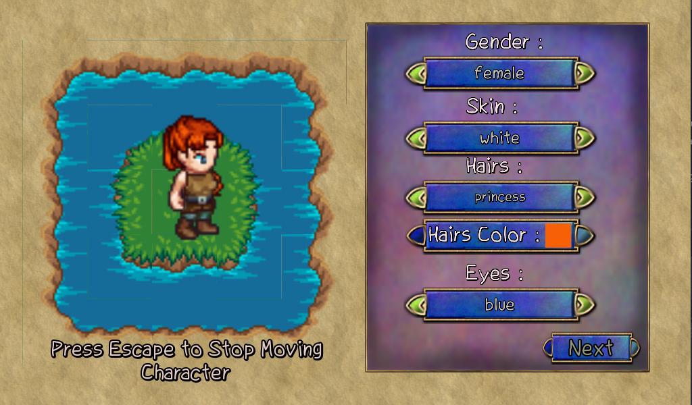

# The_Purple_Order 

## *( Warning ! )* This game is in development

For the moment I've done :

 - Creating the main menu (only the button quit and new game works)
 - Working a little in tileset and element of the game maps
 - I worked on the player and customization of the player  
 - When we start a new game, we access to the menu of player creation, and we can create our own customized character

Thanks a lot to [Universal-LPC-Spritesheet-Character-Generator](https://github.com/sanderfrenken/Universal-LPC-Spritesheet-Character-Generator/tree/master/spritesheets) and [opengameart/lpc-game-assets](https://opengameart.org/content/lpc-game-assets), they have done a formidable work, and I used it for my game graphics.

Credits file : [credits.txt](CREDITS.TXT)

## Screenshots : 

